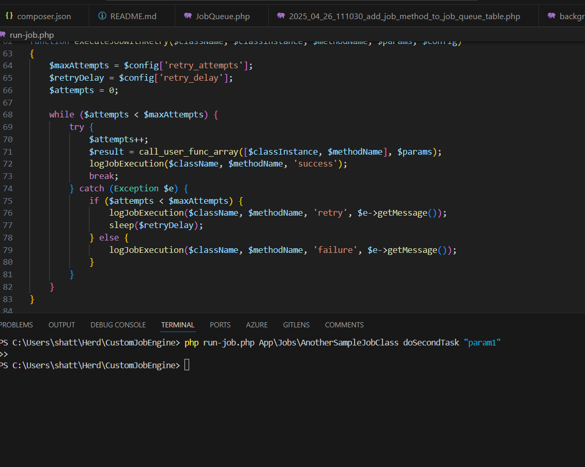
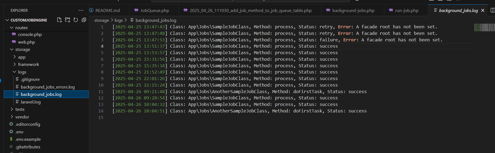
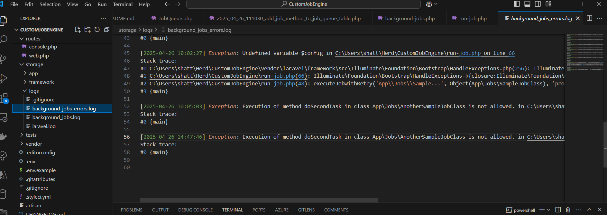
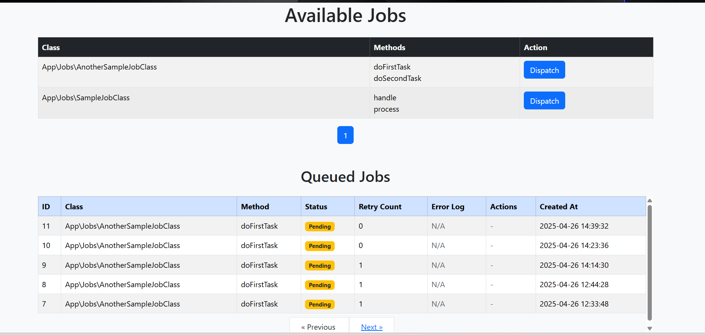
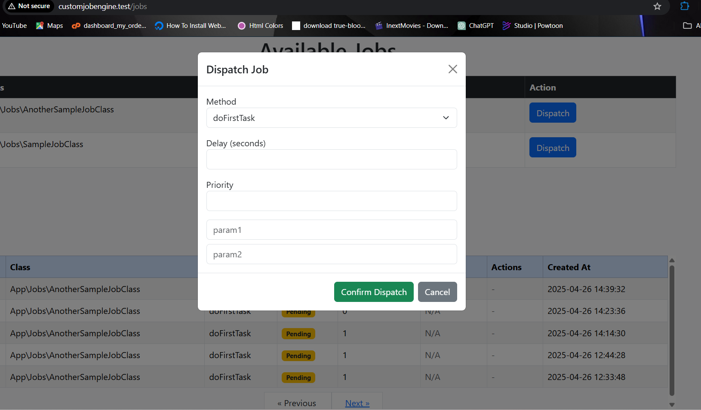

- **Overview**
- **Setup**
- **Allowed Jobs**
- **Creating Jobs**
- **Running Jobs**
- **Retry Logic Configuration**
- **Example Usage**
- **Advanced features**
- **Final notes**  


# Custom Background Job Runner

This is a custom lightweight background job runner for Laravel projects, without using Laravel’s default queue system.

It supports **retry logic**, **whitelisting allowed jobs and methods**, and **manual CLI job execution**.

---

## 1. Setup

Follow these steps to get started:

### Prerequisites

- PHP 8.1+ installed
- Composer installed
- Laravel project set up

---

### Installation

1. Clone or copy this project into your Laravel project directory.

2. Install dependencies:

```bash
composer install
```

3. Run the Laravel bootstrap (first time setup):

```bash
php artisan migrate
php artisan config:cache
```

4. Ensure the `storage/logs/` directory exists. Create it manually if it does not exist.

---

## 2. Allowed Jobs

All classes and methods that can be executed must be explicitly registered.

The configuration for allowed jobs is located in:

```
/config/background-jobs.php
```

Example of the config structure:

```php
<?php

return [
    'retry_attempts' => 3, // Number of retry attempts
    'retry_delay' => 5,     // Delay in seconds between retries

    'allowed_jobs' => [
        App\Jobs\SampleJobClass::class => [
            'process',
            'handle',
        ],
    ],
];
```

✅ Only classes and methods defined here can be run via CLI.

---

## 3. Creating Jobs

Create your job classes under any namespace (e.g., `App\Jobs`).

Example:

```php
namespace App\Jobs;

class SampleJobClass
{
    public function process($param1, $param2)
    {
        // Job logic here
    }

    public function handle()
    {
        // Another method
    }
}
```

- Each method you intend to run should be public.
- Make sure the class and methods are added to the `allowed_jobs` config.

---

## 4. Running Jobs

The main runner script is:

```
/run-job.php
```

It expects arguments in the following order:

```bash
php run-job.php [ClassName] [MethodName] [ParametersCommaSeparated]
```

### Example Commands:

Run `process` method on `SampleJobClass`:

```bash
php run-job.php App\\Jobs\\SampleJobClass process param1,param2
```

> Note: Double backslashes `\\` are needed to escape the namespace separator.

Run `handle` method without parameters:

```bash
php run-job.php App\\Jobs\\SampleJobClass handle
```



---

## 5. Retry Attempts and Delays

You can control retry behavior in:

```
/config/background-jobs.php
```

Edit these settings:

```php
'retry_attempts' => 3, // Number of times to retry the job if it fails
'retry_delay' => 5,    // Seconds to wait before retrying
```

- If the job method throws an exception, it will automatically retry based on these settings.

---

## 6. Error Logging

The runner logs output to:

- **Successful execution logs:**  
  `/storage/logs/background_jobs.log`

  

- **Failure and exception logs:**  
  `/storage/logs/background_jobs_errors.log`

  

---

## 7. Key Files Structure

| File | Purpose |
|:-----|:--------|
| `run-job.php` | Main runner script. Handles argument parsing, validation, execution, and retry. |
| `config/background-jobs.php` | Whitelist of allowed jobs and retry settings. |
| `storage/logs/` | Directory for logging job execution results and errors. |

---

## 8. Notes

- Make sure to always register new job classes and methods in `background-jobs.php`.
- Jobs should be designed to be **idempotent** (safe to retry).
- You can modify or extend `run-job.php` if you want additional features like notifications, database job tracking, etc.


# 📋 Custom Job Queue Dashboard


## 🛠 How it Works

### Dashboard (`jobs.index` view)


- **Class Discovery**:  
  All PHP classes located in `app/Jobs` are scanned. Each class's public methods (excluding constructors) are listed dynamically, along with their parameters.

- **Job Dispatching**:  
  Each method can be **dispatched** by clicking the `Dispatch` button, which triggers a **modal popup**.
  

  In the popup:
  - You can **enter job parameters** dynamically (if required by the method).
  - You can **set job priority** (higher number = higher priority).
  - You can **set a delay** (in seconds) before the job executes.

- **Job Queue Table**:
  - All queued jobs are listed with their current statuses: `pending`, `running`, `completed`, `failed`, or `cancelled`.
  - 5 jobs are shown per page for easy navigation (pagination).

---

## 🚀 Dispatch Flow

1. **Select a class/method** on the Dashboard.
2. **Fill in parameters**, set **priority** and/or **delay**.
3. **Submit** to queue the job.
4. **Job is stored** in the `job_queues` table with `pending` status.
5. **Background runner** is triggered using **Symfony Process**, starting a new background PHP process:
   ```
   nohup php artisan job:run > /dev/null 2>&1 &
   ```

---

## 🧠 RunJobs Artisan Command (`job:run`)

- Continuously picks the **next available pending job** based on:
  - **Highest priority first**.
  - Then **earliest scheduled `run_at` time**.
- **Processing Steps**:
  1. Marks job as `running`.
  2. Dynamically instantiates the class and calls the method using PHP Reflection.
  3. Injects parameters from the stored JSON `payload`.
  4. On success, updates job as `completed`.
  5. On failure, updates job as `failed` with an error message.

- **Cancellation Support**:  
  If a job is marked as `is_cancelled`, it is skipped and marked as `cancelled`.

---

## 🧩 Components Summary

| Component | Purpose |
| :--- | :--- |
| `JobController@showAvailableJobs` | Lists all job classes and methods on the dashboard |
| `JobController@dispatchJob` | Queues a job with optional delay and priority |
| `JobController@startBackgroundJobRunner` | Launches a background job runner using Symfony Process |
| `JobController@getJobStatus` | Fetches status and retry count of a job via API |
| `JobController@cancel` | Cancels a running job |
| `RunJobs` Command | Background worker that processes jobs |

---

## 📂 Important Files

- **Artisan Command**:  
  - `app/Console/Commands/RunJobs.php`
- **Job Controller**:  
  - `app/Http/Controllers/JobController.php`
- **Dashboard View**:  
  - `resources/views/jobs/index.blade.php`
- **Database Table**:  
  - `job_queue`

---

## 🔥 Features

- 🚀 Launch jobs dynamically with user-supplied parameters.
- ⏳ Delay job execution by X seconds.
- 🎯 Set priority for jobs.
- 📈 Real-time status tracking.
- 🔒 Job cancellation support.
- ⚙️ Symfony Process integration for non-blocking background execution.

---

## 🧪 Example Workflow

1. User selects `App\Jobs\SendEmail@sendWelcomeEmail`.
2. Enters **parameters** like `userId`, `emailTemplateId`.
3. Sets **priority** to 10 and **delay** to 60 seconds.
4. Job is added to the queue, background worker starts.
5. After 1 minute, the job runs, sends an email, and updates status to `completed`.